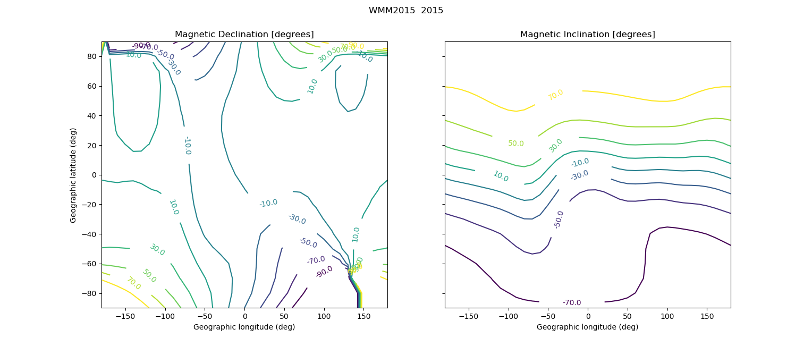

[](https://github.com/space-physics/wmm2015/actions)


[](https://pypi.python.org/pypi/wmm2015)
[](http://pepy.tech/project/wmm2015)


# WMM2015

 WMM2015 World Magnetic Model...in simple, object-oriented Python.
 Tested on Linux, Mac and Windows.
 Any modern C compiler we tried worked, including GCC, PGI and Intel compilers.
 However, at this time Visual Studio is not supported since MSVC doesn't export function symbols without additional headers (or something like SWIG).

 

## Install

To get the cutting-edge development version, `git clone` and then:

```sh
python -m pip install -e .
```

Otherwise, for the latest release from PyPi:

```sh
python -m pip install wmm2015
```

## Usage
an example script

```sh
python RunWMM2015.py
```

as a Python module:
```python
import wmm2015

mag = wmm2015.wmm(glat, glon, alt_km, yeardec)
```

## Reference


-   WMM2015 [inclination map](https://www.ngdc.noaa.gov/geomag/WMM/data/WMM2015/WMM2015_I_MERC.pdf)
-   WMM2015 [declination map](https://www.ngdc.noaa.gov/geomag/WMM/data/WMM2015/WMM2015_D_MERC.pdf)
